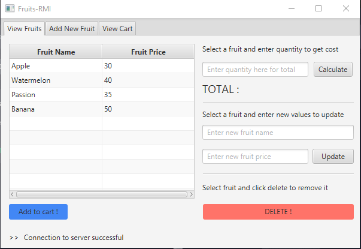

# fruits-droid

fruits-droid is a simple Java program that showcases RMI (Remote Method Invocation).  
To achieve this, there needs to be a server (**fruitservice-master**) and a client (**fruitserviceclient**).

# Steps to recreate the project
1. Git clone or download the project to your local machine
2. Using your favourite Java IDE, open **fruitservice-master** which will act as the server.
3. Run the project and leave it running in the background
4. Using your favourite Java IDE, open **fruitserviceclient** which will act as the client
5. To be able to run this project, you will need to install JavaFX by following the steps here : https://openjfx.io/openjfx-docs/
6. With JavaFX installed and configured, you can then run the project thus displaying the window shown in the screenshot below
7. If all is well, the status message "Connection to server successful" will appear at the bottom of the window
8. Proceed to use the application which can perform tasks such as listing fruits, adding fruits, updating fruits, deleting fruits, calculating total and calculating change

This project was done in collaboration with Patience Musimbi
